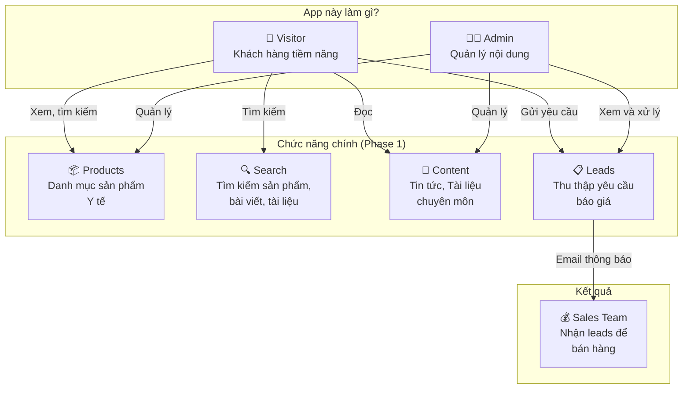
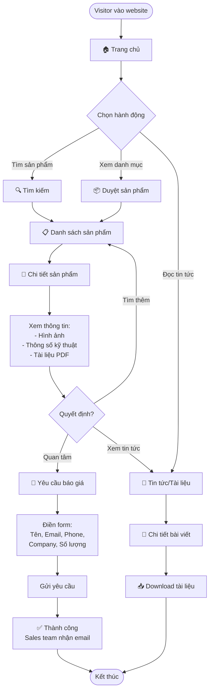
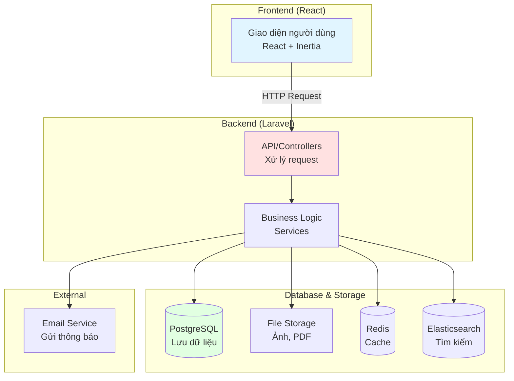

# Quick Overview Diagrams - VSEN Medical Equipment Website

**Mục đích:** Giúp mọi người hiểu nhanh app đang làm gì và các yêu cầu chính

---

## 1. System Overview - App Làm Gì?

**Tóm tắt:** Website bán thiết bị y tế - Visitor xem sản phẩm, tìm kiếm, đọc tin tức → Gửi yêu cầu báo giá → Sales team follow up.

---

## 2. User Flow - Luồng Người Dùng Chính

**Tóm tắt:** Visitor tìm/xem sản phẩm → Xem chi tiết → Nếu quan tâm thì yêu cầu báo giá → Sales team nhận thông tin.

> 💡 **Chi tiết hơn:** Xem [Flowchart Diagrams](./02-Flowchart.md) để hiểu rõ các luồng chi tiết

---

## 3. System Architecture - Cấu Trúc Đơn Giản

**Tóm tắt:** React frontend → Laravel backend → Database/Storage → Kết quả trả về cho người dùng.

> 💡 **Chi tiết hơn:** Xem các [Sequence Diagrams](./03-Sequence-Diagrams.md) để hiểu rõ luồng tương tác giữa các components

---

## 4. Key Features Summary

### Visitor Có Thể:
✅ Tìm kiếm sản phẩm (Search với auto-complete)  
✅ Xem danh sách sản phẩm (Grid/List, Filter, Sort)  
✅ Xem chi tiết sản phẩm (Ảnh, Specs, PDF downloads)  
✅ Đọc tin tức và tài liệu chuyên môn  
✅ Yêu cầu báo giá (Request Quote)  
✅ Gửi liên hệ (Contact Form)  

### Admin Có Thể:
✅ Quản lý sản phẩm (CRUD, Upload ảnh/PDF)  
✅ Quản lý tin tức và tài liệu  
✅ Xem và xử lý yêu cầu báo giá (Leads)  
✅ Bulk import/export sản phẩm  

### KHÔNG Có Trong Phase 1:
❌ Đăng ký/Đăng nhập người dùng  
❌ Giỏ hàng và thanh toán  
❌ Đa ngôn ngữ  
❌ Events/Webinars  
❌ CRM Integration  

