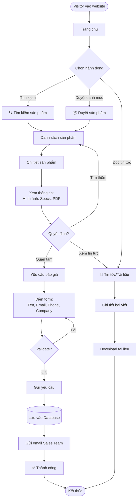
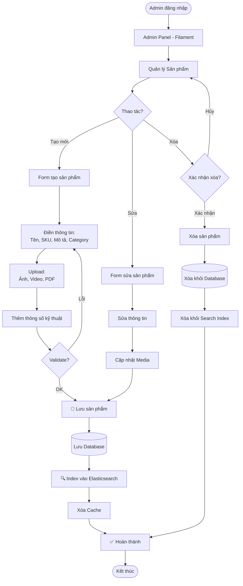
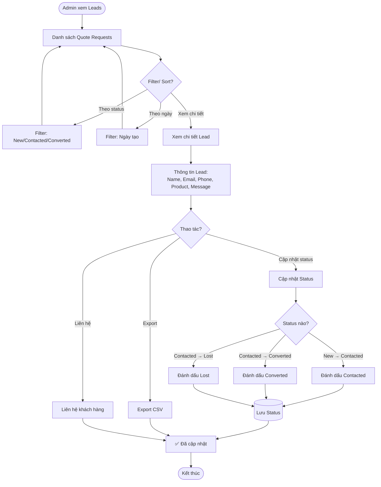

# Flowchart Diagrams - VSEN Medical Equipment Website

## 1. Visitor User Flow

```mermaid
flowchart TD
    Start([Visitor vào website])
    Start --> HomePage[Trang chủ]
    
    HomePage --> Choose{Chọn hành động}
    
    Choose -->|Tìm kiếm| Search[🔍 Tìm kiếm sản phẩm]
    Choose -->|Duyệt danh mục| Browse[📦 Duyệt sản phẩm]
    Choose -->|Đọc tin tức| News[📰 Tin tức/Tài liệu]
    
    Search --> ProductList[Danh sách sản phẩm]
    Browse --> ProductList
    ProductList --> ProductDetail[Chi tiết sản phẩm]
    
    ProductDetail --> ViewInfo[Xem thông tin:<br/>Hình ảnh, Specs, PDF]
    ViewInfo --> Decision{Quyết định?}
    
    Decision -->|Quan tâm| RequestQuote[Yêu cầu báo giá]
    Decision -->|Tìm thêm| ProductList
    Decision -->|Xem tin tức| News
    
    RequestQuote --> FillForm[Điền form:<br/>Tên, Email, Phone, Company]
    FillForm --> Validate{Validate?}
    Validate -->|Lỗi| FillForm
    Validate -->|OK| Submit[Gửi yêu cầu]
    Submit --> SaveDB[(Lưu vào Database)]
    SaveDB --> SendEmail[Gửi email Sales Team]
    SendEmail --> Success[✅ Thành công]
    
    News --> ArticleDetail[Chi tiết bài viết]
    ArticleDetail --> Download[Download tài liệu]
    
    Success --> End([Kết thúc])
    Download --> End
```

## 2. Admin Product Management Flow

```mermaid
flowchart TD
    Start([Admin đăng nhập])
    Start --> AdminPanel[Admin Panel - Filament]
    
    AdminPanel --> ManageProduct[Quản lý Sản phẩm]
    ManageProduct --> Action{Thao tác?}
    
    Action -->|Tạo mới| CreateForm[Form tạo sản phẩm]
    Action -->|Sửa| EditForm[Form sửa sản phẩm]
    Action -->|Xóa| DeleteConfirm{Xác nhận xóa?}
    
    CreateForm --> FillInfo[Điền thông tin:<br/>Tên, SKU, Mô tả, Category]
    FillInfo --> UploadMedia[Upload:<br/>Ảnh, Video, PDF]
    UploadMedia --> AddSpecs[Thêm thông số kỹ thuật]
    AddSpecs --> ValidateForm{Validate?}
    
    ValidateForm -->|Lỗi| FillInfo
    ValidateForm -->|OK| SaveProduct[💾 Lưu sản phẩm]
    
    EditForm --> EditInfo[Sửa thông tin]
    EditInfo --> UpdateMedia[Cập nhật Media]
    UpdateMedia --> SaveProduct
    
    SaveProduct --> SaveDB[(Lưu Database)]
    SaveDB --> IndexSearch[🔍 Index vào Elasticsearch]
    IndexSearch --> ClearCache[Xóa Cache]
    ClearCache --> Success[✅ Hoàn thành]
    
    DeleteConfirm -->|Xác nhận| DeleteProduct[Xóa sản phẩm]
    DeleteConfirm -->|Hủy| ManageProduct
    DeleteProduct --> DeleteDB[(Xóa khỏi Database)]
    DeleteDB --> DeleteIndex[Xóa khỏi Search Index]
    DeleteIndex --> Success
    
    Success --> End([Kết thúc])
```

## 3. Admin Lead Management Flow

```mermaid
flowchart TD
    Start([Admin xem Leads])
    Start --> LeadList[Danh sách Quote Requests]
    
    LeadList --> Filter{Filter/ Sort?}
    Filter -->|Theo status| FilterStatus[Filter: New/Contacted/Converted]
    Filter -->|Theo ngày| FilterDate[Filter: Ngày tạo]
    Filter -->|Xem chi tiết| ViewDetail[Xem chi tiết Lead]
    
    FilterStatus --> LeadList
    FilterDate --> LeadList
    
    ViewDetail --> LeadInfo[Thông tin Lead:<br/>Name, Email, Phone, Product, Message]
    LeadInfo --> Action{Thao tác?}
    
    Action -->|Cập nhật status| UpdateStatus[Cập nhật Status]
    Action -->|Export| ExportCSV[Export CSV]
    Action -->|Liên hệ| Contact[Liên hệ khách hàng]
    
    UpdateStatus --> StatusType{Status nào?}
    StatusType -->|New → Contacted| MarkContacted[Đánh dấu Contacted]
    StatusType -->|Contacted → Converted| MarkConverted[Đánh dấu Converted]
    StatusType -->|Contacted → Lost| MarkLost[Đánh dấu Lost]
    
    MarkContacted --> SaveStatus[(Lưu Status)]
    MarkConverted --> SaveStatus
    MarkLost --> SaveStatus
    
    SaveStatus --> Success[✅ Đã cập nhật]
    ExportCSV --> Success
    Contact --> Success
    
    Success --> End([Kết thúc])
```

