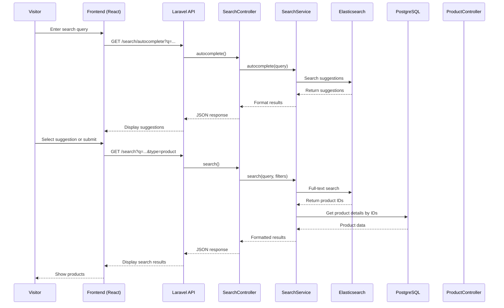
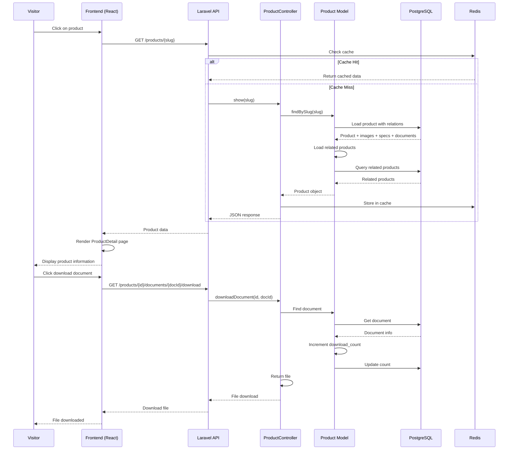
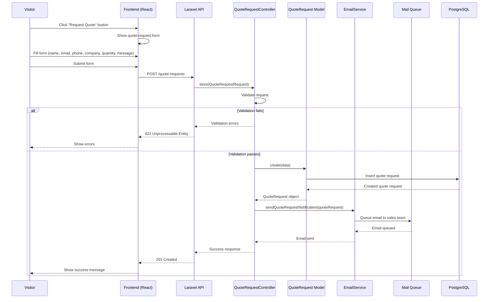
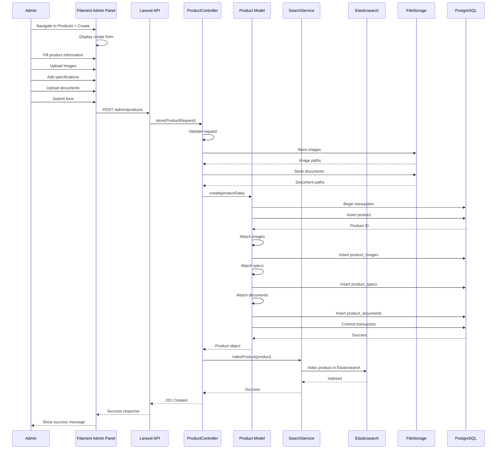
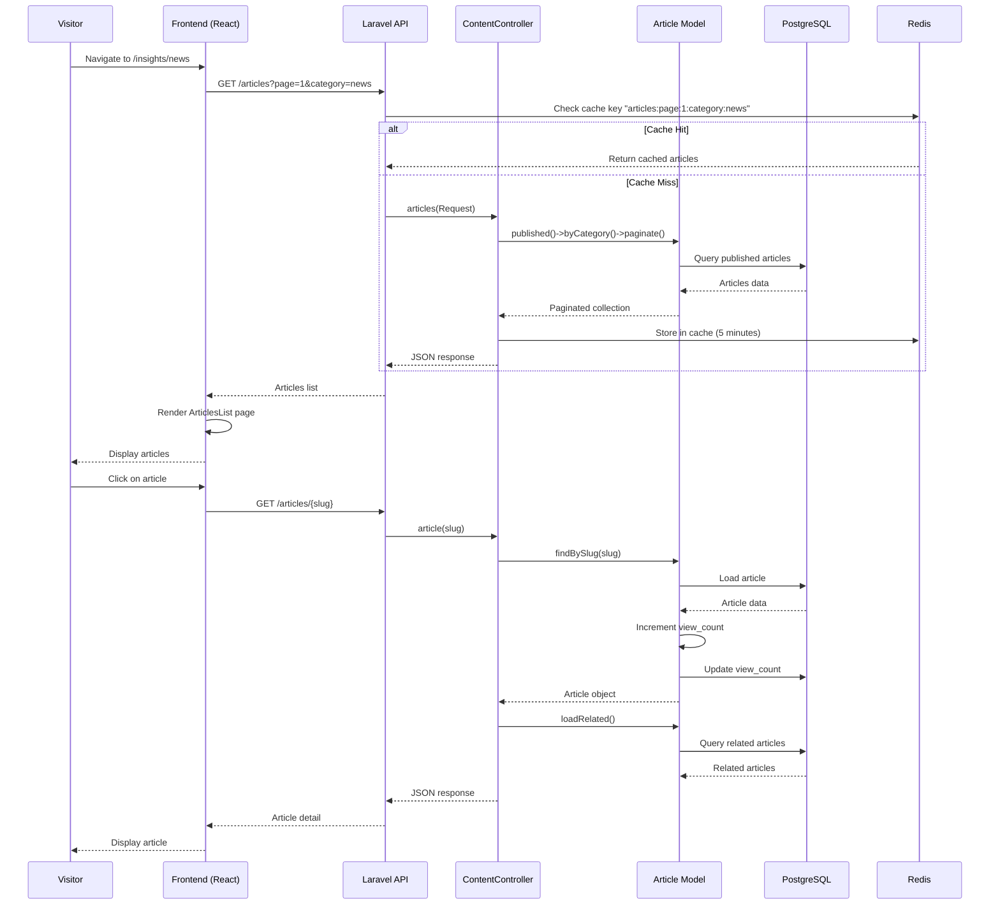
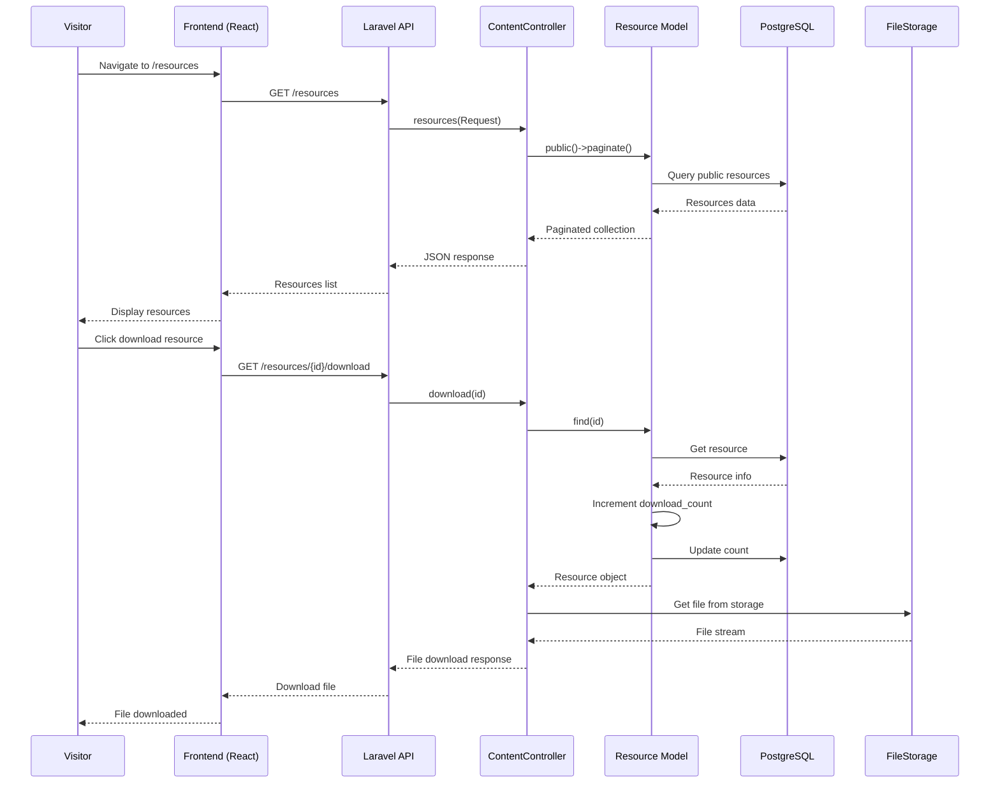

# Sequence Diagrams - VSEN Medical Equipment Website

## Overview

Sequence diagrams mô tả luồng tương tác giữa các components trong các use cases chính.

## 1. Search Products Sequence

## 2. View Product Detail Sequence

## 3. Request Quote Sequence

## 4. Admin Create Product Sequence

## 5. View Articles Sequence

## 6. Download Resource Sequence

## Key Interactions

### Caching Strategy
- **Product listings:** Cache 5 minutes
- **Product detail:** Cache 10 minutes
- **Articles:** Cache 5 minutes
- **Search results:** Cache 2 minutes

### Database Transactions
- Product creation uses transaction to ensure data consistency
- All related data (images, specs, documents) created atomically

### Queue Processing
- Email notifications queued for async processing
- Prevents blocking user requests

