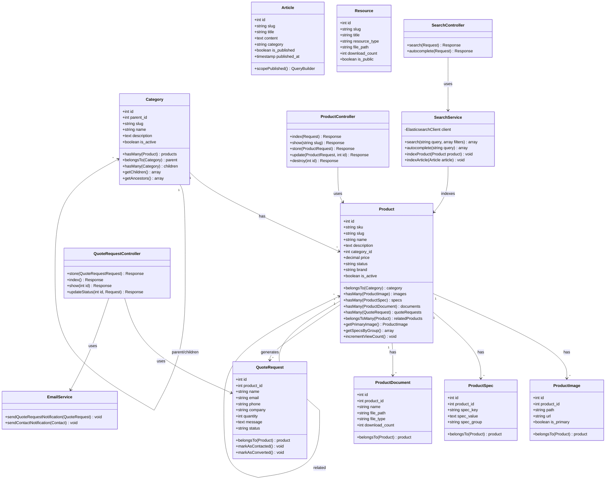

# Class Diagram - VSEN Medical Equipment Website

## Class Diagram

```mermaid
classDiagram
    class Category {
        +int id
        +int parent_id
        +string slug
        +string name
        +text description
        +boolean is_active
        +hasMany(Product) products
        +belongsTo(Category) parent
        +hasMany(Category) children
        +getChildren() array
        +getAncestors() array
    }
    
    class Product {
        +int id
        +string sku
        +string slug
        +string name
        +text description
        +int category_id
        +decimal price
        +string status
        +string brand
        +boolean is_active
        +belongsTo(Category) category
        +hasMany(ProductImage) images
        +hasMany(ProductSpec) specs
        +hasMany(ProductDocument) documents
        +hasMany(QuoteRequest) quoteRequests
        +belongsToMany(Product) relatedProducts
        +getPrimaryImage() ProductImage
        +getSpecsByGroup() array
        +incrementViewCount() void
    }
    
    class ProductImage {
        +int id
        +int product_id
        +string path
        +string url
        +boolean is_primary
        +belongsTo(Product) product
    }
    
    class ProductSpec {
        +int id
        +int product_id
        +string spec_key
        +text spec_value
        +string spec_group
        +belongsTo(Product) product
    }
    
    class ProductDocument {
        +int id
        +int product_id
        +string name
        +string file_path
        +string file_type
        +int download_count
        +belongsTo(Product) product
    }
    
    class QuoteRequest {
        +int id
        +int product_id
        +string name
        +string email
        +string phone
        +string company
        +int quantity
        +text message
        +string status
        +belongsTo(Product) product
        +markAsContacted() void
        +markAsConverted() void
    }
    
    class Article {
        +int id
        +string slug
        +string title
        +text content
        +string category
        +boolean is_published
        +timestamp published_at
        +scopePublished() QueryBuilder
    }
    
    class Resource {
        +int id
        +string slug
        +string title
        +string resource_type
        +string file_path
        +int download_count
        +boolean is_public
    }
    
    class ProductController {
        +index(Request) Response
        +show(string slug) Response
        +store(ProductRequest) Response
        +update(ProductRequest, int id) Response
        +destroy(int id) Response
    }
    
    class SearchController {
        +search(Request) Response
        +autocomplete(Request) Response
    }
    
    class QuoteRequestController {
        +store(QuoteRequestRequest) Response
        +index() Response
        +show(int id) Response
        +updateStatus(int id, Request) Response
    }
    
    class SearchService {
        -ElasticsearchClient client
        +search(string query, array filters) array
        +autocomplete(string query) array
        +indexProduct(Product product) void
        +indexArticle(Article article) void
    }
    
    class EmailService {
        +sendQuoteRequestNotification(QuoteRequest) void
        +sendContactNotification(Contact) void
    }
    
    %% Relationships
    Category "1" --> "*" Product : has
    Category "1" --> "*" Category : parent/children
    Product "1" --> "*" ProductImage : has
    Product "1" --> "*" ProductSpec : has
    Product "1" --> "*" ProductDocument : has
    Product "1" --> "*" QuoteRequest : generates
    Product "*" --> "*" Product : related
    
    ProductController --> Product : uses
    SearchController --> SearchService : uses
    SearchService --> Product : indexes
    QuoteRequestController --> QuoteRequest : uses
    QuoteRequestController --> EmailService : uses
```

