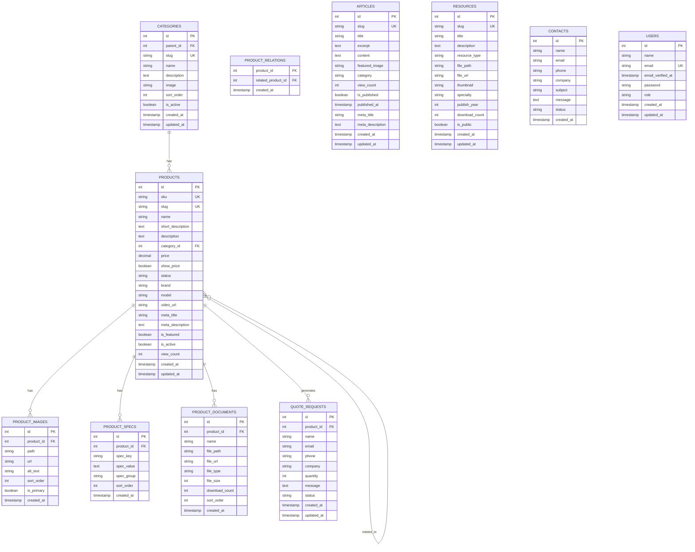

# Entity Relationship Diagram (ERD) - VSEN Medical Equipment Website

## Database Schema Overview

### Core Entities

1. **categories** - Product categories (hierarchical)
2. **products** - Main product entity
3. **product_images** - Product images
4. **product_specs** - Product specifications
5. **product_documents** - Product documents (PDFs, manuals)
6. **product_relations** - Related products (many-to-many)
7. **quote_requests** - Quote requests from visitors
8. **articles** - News articles
9. **resources** - Resources (whitepapers, case studies)
10. **contacts** - Contact form submissions
11. **users** - Admin users

## Entity Relationship Diagram (Mermaid)



## Relationships Detail

### 1. Categories → Products (One-to-Many)
- One category can have many products
- Product belongs to one category (nullable)
- Foreign Key: `products.category_id` → `categories.id`
- ON DELETE: SET NULL (allows category deletion)

### 2. Products → Product Images (One-to-Many)
- One product can have many images
- Foreign Key: `product_images.product_id` → `products.id`
- ON DELETE: CASCADE (images deleted when product deleted)
- Constraint: Only one primary image per product

### 3. Products → Product Specs (One-to-Many)
- One product can have many specifications
- Foreign Key: `product_specs.product_id` → `products.id`
- ON DELETE: CASCADE

### 4. Products → Product Documents (One-to-Many)
- One product can have many documents
- Foreign Key: `product_documents.product_id` → `products.id`
- ON DELETE: CASCADE

### 5. Products → Quote Requests (One-to-Many)
- One product can generate many quote requests
- Foreign Key: `quote_requests.product_id` → `products.id`
- ON DELETE: SET NULL (allows product deletion)

### 6. Products ↔ Products (Many-to-Many)
- Products can be related to other products
- Junction table: `product_relations`
- Foreign Keys: `product_id`, `related_product_id` → `products.id`
- ON DELETE: CASCADE

### 7. Categories → Categories (Self-Referential)
- Categories can have parent categories (hierarchical)
- Foreign Key: `categories.parent_id` → `categories.id`
- ON DELETE: SET NULL

## Key Constraints

### Unique Constraints
- `products.sku` - Unique SKU per product
- `products.slug` - Unique slug per product
- `categories.slug` - Unique slug per category
- `articles.slug` - Unique slug per article
- `resources.slug` - Unique slug per resource
- `users.email` - Unique email per user

### Indexes

**Performance Indexes:**
- `products.category_id` - For filtering by category
- `products.is_active` - For active products filter
- `products.status` - For status filter
- `products.brand` - For brand filter
- `products.sku` - For SKU search
- `quote_requests.status` - For lead management
- `quote_requests.created_at` - For date sorting
- `articles.is_published` + `articles.published_at` - Composite index for published articles

**Partial Unique Index:**
- `product_images.is_primary` - Ensures only one primary image per product

## Data Flow Summary

```
Visitor Request Quote
    ↓
quote_requests table
    ↓
Admin views in Filament
    ↓
Sales team follows up
```

```
Admin creates Product
    ↓
products table
    ↓
product_images, product_specs, product_documents
    ↓
Visitor views Product Detail
```

